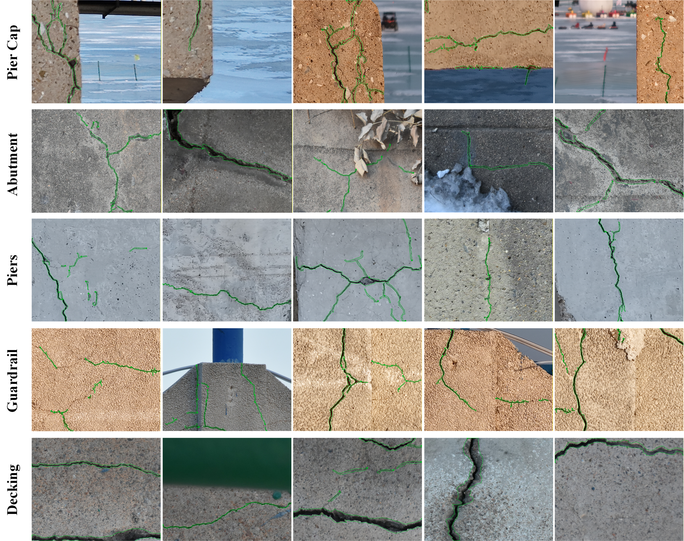

# SZCrack
SZ_Crack dataset: 1,466 annotated bridge crack samples (1280×1024) from DJI Mavic 3 Pro and Nikon D7200 imagery. Covers pier caps, guardrails, abutments, piers, and decks across bridges in Shanghai, Jinzhou, and Huludao. Addresses low-resolution gaps in open crack data for reliable intelligent inspection deployment.

Tip: The corresponding annotation files—including JSON (label metadata), mask (pixel-level segmentation ground truth), and YOLOv8-seg TXT (instance segmentation training format)—are currently withheld and will be made publicly available upon the official acceptance and publication of the associated research paper. This staged release is intended to ensure proper academic attribution and alignment with the peer-review process.
