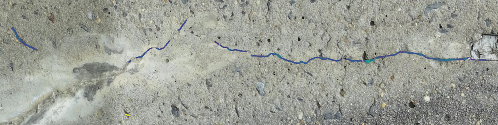

# SZCrack
SZ_Crack dataset: 1,466 annotated bridge crack samples (1280×1024) from DJI Mavic 3 Pro and Nikon D7200 imagery. Covers pier caps, guardrails, abutments, piers, and decks across bridges in Shanghai, Jinzhou, and Huludao. Addresses low-resolution gaps in open crack data for reliable intelligent inspection deployment.

Tip: The corresponding annotation files—including JSON (label metadata), mask (pixel-level segmentation ground truth), and YOLOv8-seg TXT (instance segmentation training format)—are currently withheld and will be made publicly available upon the official acceptance and publication of the associated research paper. This staged release is intended to ensure proper academic attribution and alignment with the peer-review process.

---

## Donghai Bridge UAV Field Test

We conducted a small-scale field test on the Donghai Bridge using a self-developed UAV equipped with a Hikvision camera. The UAV features on-device real-time inference capable of automatically detecting infrastructure defects during flight (see Figures 1–3). 

|  |  |  |
|:--:|:--:|:--:|
| *Figure 1* | *Figure 2* | *Figure 3* |

Since the Donghai Bridge undergoes annual maintenance and has relatively few cracks and other defects, we present one representative detection result below (Figure: PartialEffect). For additional scene-level recognition results, please refer to the accompanying paper.

- 🎬 [UAV_test.mp4](UAV_test_DonghaiBridge/UAV_test.mp4) — UAV inspection flight with real-time defect detection
- 🎬 [UAV_view.mp4](UAV_test_DonghaiBridge/UAV_view.mp4) — Hikvision camera onboard view of Donghai Bridge

### Collaboration

We welcome collaboration and exchange with researchers working on infrastructure defect detection for bridges, tunnels, roads, and related applications. Please feel free to reach out.

*Collaborative Perception Laboratory, Shanghai Jianqiao University*  
*Shanghai Rail Transit Maintenance Support Co.,Ltd*

📧 **symeng4442@163.com**

